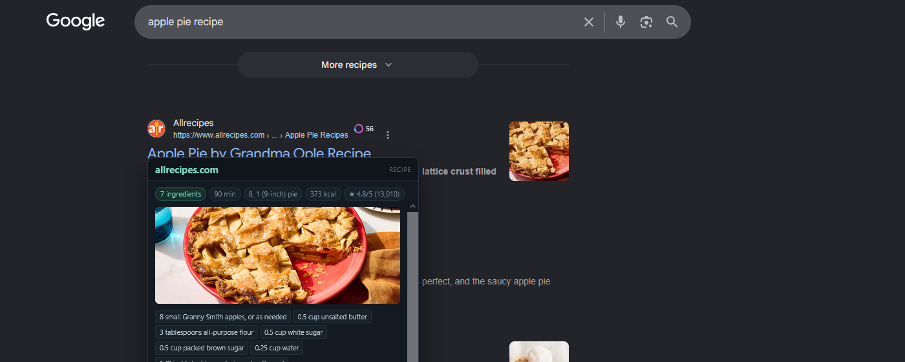

# Peek

**Read a link before you open it.**

Hover a link and Peek shows what is actually on the other side — a recipe's
ingredients and steps, an article's text, a product's price, a repository's
README — so you can decide whether to open it.

The web is a corridor of doors with nothing written on them. Peek puts a window
in each one.

<p align="center">
  
</p>

<!-- docs/screenshots/ -->

---

## What it shows

| Hovering | You get |
|---|---|
| A recipe | Ingredient list and numbered steps, grouped by section |
| An article | The text, without ads, cookie banners or the newsletter box |
| A product | Price, availability, brand, rating |
| A GitHub repo | The README, plus stars, language, licence, last push |
| A job posting | Company, location, salary, date posted |
| A deceptive link | Why it is deceptive, above everything else |

The domain is the largest thing on the card, and where it is registered sits
next to it: `sqlmanager.net` `RU Russia`. A click-tracker at `ipro3.dmesp.ru`
reads as noise until something says *Russia* beside it. Redirects show the hop
they travelled through on their own line, with its own country.

Registries with a long history of abuse — `.tk`, `.top`, `.xyz`, `.click` and
the rest — are marked in red rather than merely named.

Anything already visible on the page you are on is deliberately left out. No
repeated title, no link description, no URL breakdown — those tell you nothing
you cannot already see.

The exception is trouble. If a link has an `@` before the domain, a punycode
lookalike, or link text claiming one site while pointing at another, the
warnings and the dissected URL jump to the top of the card.

## Install

**Firefox** — `about:debugging#/runtime/this-firefox` → Load Temporary Add-on →
`Firefox/manifest.json`

**Chrome** — `chrome://extensions` → Developer mode → Load unpacked → the
`Chrome/` folder

Both unload when the browser closes. Permanent installs need store signing.

## When something is wrong

Peek has already fetched the page, so it can ask what the page *is* rather than
whether its URL appears on a list. That matters: phishing domains live hours,
so any bundled feed is stale before it ships, and a live lookup would mean
telling a server what you are about to open — the one thing Peek promises not
to do.

What it looks for:

- **A page claiming a brand it is not served from.** A login page titled
  "PayPal" on `paypal-secure.account-verify.xyz`. Never goes stale, needs no
  feed.
- **A form that posts elsewhere.** What you type going to a different site
  than the one you are on.
- **A password field somewhere odd** — a throwaway registry, a bare IP, a
  punycode look-alike. A bare login page on an ordinary domain says nothing;
  GitHub's looks exactly like that.
- **An instant forward** to another host.
- **The redirect route**, every hop of it.

When any of it fires, the card takes a red or amber border, a drawn warning
sign and a banner directly under the domain, so a bad link looks wrong across a
page of results before you have read a word.

These are observations, never verdicts. *"This page calls itself PayPal and is
served from paypal-secure.xyz"* is a fact you can check. Peek is not antivirus
and does not pretend to be — your browser's Safe Browsing already does that job.

## Email addresses

An address is a link too. Hovering a `mailto:` shows its domain and warns about
a disposable mailbox, a brand in the local part the domain does not support, or
link text that claims one address while writing to another.

The one worth knowing: an address that reads like an office — `aid`, `claim`,
`refund`, `support`, `department` — sent from a free mail provider. A charity's
operations manager does not write from Hotmail. Ordinary personal addresses at
free providers say nothing, because there is nothing to say.

## What it ignores

Peek skips navigation: menus, breadcrumbs, tab strips and footers. Those peeks
tell you nothing you did not already know, and the card would cover the row of
links you are trying to read past. A link counts as navigation when it sits in
`<nav>`, carries a navigation ARIA role, is in a `<footer>`, has an ancestor
whose class or id matches a navigation word as a whole word (`navbar`,
`breadcrumbs`, `sidebar`, `pagination`…), or is inside a list where more than
70% of the text is link text.

Detection is deliberately conservative, because a false positive silently
removes a peek you wanted. `src/link/nav.js` holds the rules, and
`__peek.why("selector")` in the console reports which one matched. Turn the
whole thing off in the popup.

## Appearance and per-site control

The toolbar popup carries a light/dark/auto switch — auto follows the browser —
and a **Don't use Peek on this site** toggle for whatever site you are on.
Switching a site off stops the card *and* stops any request, because both the
content script and the background read the same policy. Sites you have switched
off are listed underneath, and clicking one turns it back on.

## Controls

| | |
|---|---|
| Hover | Show the page's content |
| `L` | Fetch on demand, when hover-fetching is off |
| `Esc` | Dismiss |
| `Alt`+`Shift`+`P` | Turn Peek off and on |
| **Open ↗** | Visit the page for real |

## Peek makes network requests

This is the one thing to understand before installing. When "read pages on
hover" is on, resting on a link asks that site for its page. The site sees a
request from your IP address and can log it.

Everything else is built to keep that fact as small as possible:

- **No cookies** are sent or stored — the site sees you logged out, always
- **No referrer**, so it never learns which page you were on
- **No JavaScript runs**, so its analytics and ad pixels never fire. A peek is
  quieter than an actual visit
- **Nothing enters your history**
- Responses live in memory for five minutes, then vanish

Links that log out, unsubscribe, confirm, pay, or carry one-time tokens are
never fetched. Neither is webmail — hovering a link in your inbox would
register the click with whoever sent it.

Turn off "read pages on hover" and Peek makes no requests at all.

On webmail, Peek never fetches on its own — a link in a newsletter is usually a
click-tracker, and asking for it would register the click with whoever sent the
mail. You still get the card: the real destination, its country, and the hop it
travels through, all read from the link itself. `NO_FETCH_HOSTS` in
`config/sites.js` controls this.

Full detail in [PRIVACY.md](PRIVACY.md).
## What Peek does and does not protect you from

Peek is meaningfully safer than opening a page, but it is not armour, and it
would be dishonest to sell it as such.

**True, and worth relying on:**

- **The site's JavaScript never runs.** The page is parsed, never executed, and
  never navigated to. `<script>`, `<iframe>`, `<form>`, `<svg>`, every `on*`
  handler and every `javascript:` URL is removed before anything reaches the
  card. That is the single largest drive-by attack surface, and Peek does not
  exercise it.
- **No cookies** are sent or stored, so nothing can be set on you.
- **Nothing is downloaded**, and nothing enters your history.
- **Deceptive links are named before you act**: an `@` before the domain, a
  punycode lookalike, link text claiming one site and pointing at another, and
  where the domain is registered.

**Still exposed, and you should know it:**

- **Images.** With images on, your browser decodes image data from that server.
  Image decoders have had real zero-click vulnerabilities — libwebp
  CVE-2023-4863 in 2023 was exploited in the wild against Chrome and Firefox.
  Turning images off in the popup closes the largest remaining hole.
- **The HTML parser** still parses hostile input, and Peek's sanitizer is a
  boundary that could contain a bug like any other code.
- **Phishing.** Peek makes a deceptive link easier to spot; it cannot stop you
  clicking **Open** afterwards.
- **The site still learns your IP address**, exactly as it would from a visit.

So: *"the site's JavaScript never runs"* is a statement of fact you can check.
*"Peek cannot infect your computer"* is not, and should not be claimed.


## Layout

```
src/                 the only place you edit
  config/rules.js    timings, caps, junk patterns, safety rules
  config/sites.js    per-site: disabled, selectors, paywall notes
  config/trackers.js tracking parameters, families and who owns them
  common/            log, text, URL parsing, per-site policy
  link/              what the link alone reveals, before any request
  extract/           JSON-LD and OpenGraph -> facts
  reader/            Readability -> sanitize -> tidy -> node tree
  sites/             handlers for sites whose content is not in the HTML
  background/        gate, fetcher, cache, pipeline
  content/           hover, card, settings
  popup/             settings and the disclosure notice

platform/
  firefox/           MV2 background page, which has a DOM
  chrome/            MV3 worker plus an offscreen document, because MV3
                     service workers have no DOM

build/modules.json   the load order, defined once
build.py             generates Chrome/ and Firefox/
tests/               runs against src/, never against a build

Chrome/  Firefox/    GENERATED. Committed so they can be uploaded to the
                     stores directly; never edited by hand.
```

## Working on it

```sh
npm install          # jsdom, for the tests
npm run build        # regenerate Chrome/ and Firefox/
npm test             # 50 cases, 284 assertions
npm run verify       # syntax + builds up to date + tests
```

Edit `src/`, run `npm run build`, reload the extension. Everything except
`platform/` is shared, and the script lists in both manifests and in Chrome's
offscreen document are generated from `build/modules.json` — so a module can no
longer be added to one browser and forgotten in the other, which is how Peek's
two worst runtime bugs happened.

## How a lookup works

```
hover
  ↓
link/analyze.js      reads the link itself — no request
  ↓                  unwraps google.com/url?q=… and base64 mail trackers
background/gate.js   may this be fetched at all?
  ↓
sites/*.js           does a handler own this URL?
  ↓ no
background/fetcher   capped, credential-free GET
  ↓
extract/             JSON-LD → OpenGraph → meta
reader/              named selector → Readability → sanitize → tidy
  ↓
content/card.js      render
```

## Making changes

Most changes touch one of two files.

```js
// config/rules.js — general behaviour
DWELL_MS: 320,
MAX_IMAGES: 1,          // one photo for an article; listings get more
MAX_LINK_DENSITY: 0.55, // above this it is a menu, not an article

// config/sites.js — per-site
DISABLED_HOSTS: [ /(^|\.)youtube\.com$/ ],
CONTENT_SELECTORS: [ { host: /(^|\.)npmjs\.com$/, sel: ["#readme"] } ],
SITE_NOTES: { "wsj.com": ["Hard paywall", "warn"] }
```

See [CONTRIBUTING.md](CONTRIBUTING.md) for the full map, and
`src/sites/README.md` for sites that need real code.

## Design notes

**The card is the content, not a description of the link.** An early version
showed the domain, the URL and a scraped snippet, and every one of those was
already on screen. If Peek has nothing to add, it should say nothing.

**Recipes skip Readability.** A recipe page's prose is mostly the author's
childhood and a newsletter pitch. The ingredients and steps come from JSON-LD
instead, which every recipe site already publishes for Google.

**Image size comes from the URL, not the `width` attribute**, because the
attribute lies. sme.sk serves author thumbnails as
`src=".../image/w75-h75/<id>.jpg" srcset="... 75w" width="640" height="360"` —
a 75px file claiming to be 640. Peek takes the smallest hint in the URL or
`srcset` and only falls back to the attribute when there is none.

**Mostly-links means not an article.** Rather than writing a rule per site for
every mega menu, anything whose extracted text is more than 55% link text is
refused as an index.

**Chrome runs the engine in an offscreen document.** MV3 service workers have
no DOM and Peek cannot parse HTML without one. `Chrome/src/offscreen/` loads
the same files, in the same order, that Firefox loads in its background page.

**Firefox stays on MV2.** Under MV3, Firefox treats host permissions —
including `content_scripts` match patterns — as optional and ungranted at
install. Nothing prompts the user, so the content script silently never
injects: no card, no errors, no logs.

## Known limits

- Sites with no structured data fall back to `<title>` and description, which
  is often no better than reading the link
- JavaScript-rendered pages ship an empty shell; Peek reports this rather than
  showing a blank card
- The GitHub handler uses the unauthenticated API — 60 requests an hour
- The adult and high-risk host list is keyword-based and shallow; a serious
  deployment should bundle a proper category list
- Visited/unvisited link state is deliberately unavailable to extensions, so
  Peek cannot show it

## The icon

A peephole set in a door — the metaphor the extension is built on.

Each size is **drawn, not scaled**. `docs/icon/make-icons.py` redraws the mark
per size, because a 128px icon shrunk to 16px turns to mush: the hinge seam
only appears at 48px and up, the catch of light on the lens and the door knob
only at 128. `docs/icon/peek.svg` is the 128px form for anywhere scalable is
wanted.

Two directions were tried and rejected, recorded so nobody re-treads them: a
teal tile with a dark circle reads as a camera lens, the wrong association for
a tool whose selling point is that it does not watch you; and a door standing
ajar with light spilling out collapses into a media play button at 16px.

```sh
python3 docs/icon/make-icons.py Firefox/icons     # needs Pillow
```

## Licence

MIT — see [LICENSE](LICENSE). Bundled third-party code in
[THIRD-PARTY.md](THIRD-PARTY.md), store-review notes in
[REVIEWER-NOTES.md](REVIEWER-NOTES.md), and Web Store form answers in
[docs/chrome-webstore-form.md](docs/chrome-webstore-form.md).
